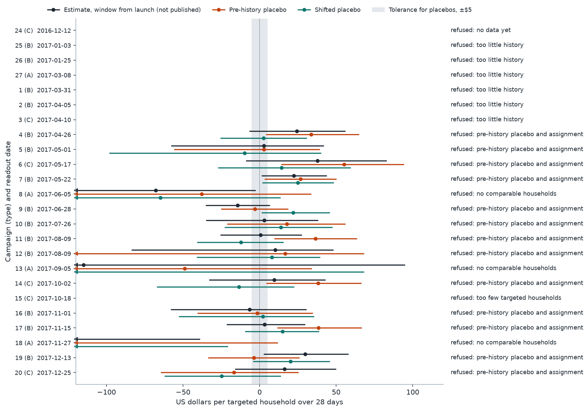
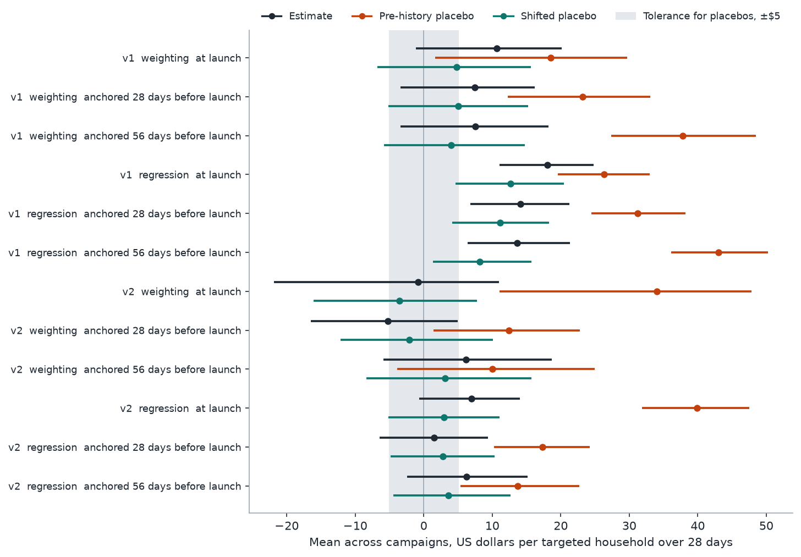
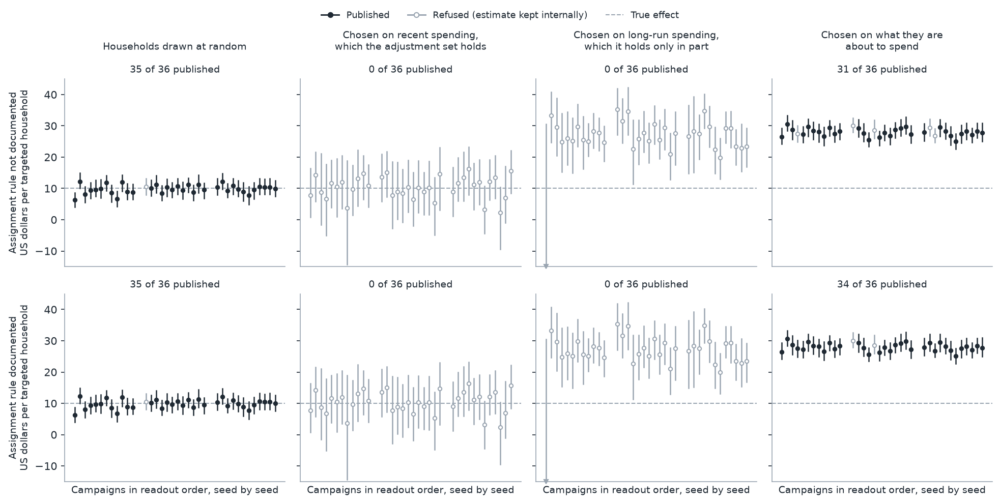
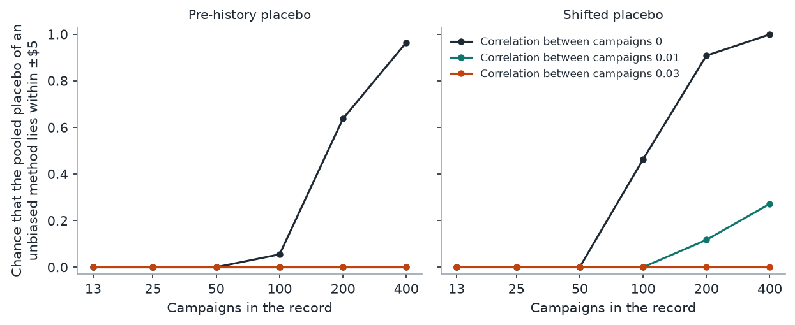

<p align="center">
  
</p>

# campaign-readout-pipeline

[](https://github.com/DiogoRibeiro7/campaign-readout-pipeline/actions/workflows/ci.yml)
[](https://github.com/DiogoRibeiro7/campaign-readout-pipeline/actions/workflows/reproduce.yml)
[](https://github.com/DiogoRibeiro7/campaign-readout-pipeline/releases/latest)
[](pyproject.toml)
[](LICENSE)

A pipeline that estimates what a marketing campaign added to sales, and
publishes the estimate only when a set of conditions declared in advance holds.
When one does not hold it publishes a refusal that names it. A refusal is a
different type from an estimate and has no field for an effect.

The starting point is a prototype: the script behind the article *A Placebo Can
Pass and Still Be as Large as the Estimate*, kept unchanged in `prototype/`. It
analysed sixteen coupon campaigns of a grocery retailer in one pass over a year
of data. This repository asks what has to be added before that analysis could
run every time a campaign ends, with nobody watching, and what such a pipeline
does when it is run over the same year, one readout at a time.

On this data it publishes nothing. The reasons are the result.

## What came out

Amounts are US dollars per targeted household over 28 days, with 95% bootstrap
intervals. Every number below comes from the files `readout report` writes
into `results/`: [`RESULTS.md`](results/RESULTS.md), the CSV tables and
`readouts.jsonl`. Some take a line of arithmetic on those tables. Two are
quoted from the prototype's own results file.

Most of them are estimates the pipeline refused to publish. They are quoted
from its internal audit trail, to explain the refusals. A consumer never
receives an effect estimate that was refused; what a refusal carries is what
the gates measured, the placebos among them. None of the numbers here should
be read as the effect of a campaign.

### It reproduces the prototype, then changes two things

Given the prototype's inputs and choices, the pipeline returns the prototype's
published estimates for all sixteen campaigns, both windows and both
estimators, with a largest difference of 0. Two changes follow, because a
readout that runs on the day a campaign's window closes cannot do what the
prototype did.

| Change | Why | Households in an analysis | One campaign's regression estimate moves by |
|---|---|---|---|
| Data as of the readout date | The prototype read the whole year. A readout in April cannot see a household that first shops in June. | 2,469 in the year, as few as 2,322 on a readout date | $0.08 on average, $0.30 at most |
| Households seen before the day the covariates are dated | Once the data is cut at the readout date, a household that first appears after the launch is there only because it bought something during the window being measured, and it has no recorded history to adjust for. | As few as 2,266 for a readout and 2,168 for a shifted placebo | $0.06 on average, $0.32 at most |

The mean regression estimate over the sixteen campaigns goes from 17.37 to
17.37 to 17.39. Under weighting the largest move of one campaign from either
change is $0.83 for an estimate and $1.78 for a shifted placebo. Neither change
matters to the numbers. Both matter to whether they could have been computed on the day, on
households chosen without looking at the outcome.

The prototype's third estimator, nearest-neighbour matching, is not carried
over. The standard bootstrap is not valid for it (Abadie and Imbens 2008), and
the placebo gates read bootstrap intervals.

### Replayed in order, the year yields 24 readouts and no published estimate

The outcome windows of three more campaigns close after the data ends. Their
readouts are not due, and nothing is recorded for them.

| Refused at | Readouts | What the gate found |
|---|---|---|
| Data | 8 | Six campaigns launched before the feed held the 84 days a readout and its placebos need. One fell due before the feed starts. One was sent to 17 households |
| Overlap | 3 | The three largest campaigns of the year, all of Type A and each sent to more than a thousand households. Between 18% and 41% of their targeted households have a propensity score above 0.9, where the limit is 10%. The gate stops there; for the same analysis its stored measurements also show a weighted comparison group worth 7 to 8 households, with a single household carrying 23% to 35% of the weight |
| Both placebo gates | 13 | Below |

One campaign rarely settles anything. Across the thirteen, the placebo
intervals are $62 and $70 wide at the median, against a tolerance band $10
wide. Three campaigns nonetheless have an own pre-history placebo that lies
wholly outside the tolerance. For the other ten the gate asks the method's
record, and the record does not vouch for the method. It holds fewer than five
campaigns at the first four of the thirteen readouts. From the fifth on, its
range for the placebo effect of a campaign is never inside the tolerance, and
at the fifth, sixth and seventh (campaigns 9, 10 and 11) the mean of the
pre-history record lies wholly outside it.



### Taken together, the placebos do not show what a readout needs

The mean over the thirteen campaigns that passed the data, timing and overlap
gates, each counted once:

| Method | Estimate (not published) | Pre-history placebo | Shifted placebo |
|---|---|---|---|
| Weighting, the primary method | 10.69 [-1.13, 20.10] | 18.54 [1.67, 29.73] | 4.83 [-6.77, 15.67] |
| Regression, in shadow | 18.04 [11.05, 24.80] | 26.31 [19.54, 32.97] | 12.70 [4.61, 20.49] |

The shifted placebo is the prototype's: the whole analysis moved back one
window, to a time when the campaign had not been sent. For the same thirteen
campaigns the prototype reported 10.90 [-2.60, 20.78] for the estimate and 4.89
[-7.12, 15.32] for this placebo, so the production rules leave both about
where they were. Under weighting the placebo's interval contains zero, which is the
criterion the prototype used for a pass. The same interval reaches $15.67,
three times the tolerance and more than the estimate beside it. It is
compatible with no placebo effect and with one larger than the estimate.

The pre-history placebo is the one the prototype did not run: spending in the
28 days before the history begins, adjusted with the readout's own covariates
and the other campaigns live in that window. It tests one claim together with
the adjustment itself: that households were chosen on nothing but what the
adjustment set holds, and that the model adjusts for it correctly. Under
regression the pooled interval lies wholly beyond the tolerance, so the data
speaks against that. Under weighting the pooled interval excludes zero but not
$5, which the contract's own rule calls inconclusive, and a lower end of $1.67
on skewed bootstrap draws is not something to lean on. The firmer evidence
under weighting is campaign by campaign: six of the thirteen intervals exclude
zero, all on the positive side, and three lie wholly beyond the tolerance.

The placebo is not a measurement of the readout's error in dollars, and the two
placebos are not two estimates of one quantity. The pre-history placebo is the
larger by about $14 under both methods; the interval for the difference is
[2.87, 24.66] under regression and [-4.89, 27.86] under weighting.

The smallest tolerance at which the programme readout would have been
published under weighting is $29.73, the upper end of the pooled pre-history
interval. It is the tightest bound this year of data puts on the size of the
mean placebo effect, and it is nearly three times the estimate. The interval
runs about $14 either side of a midpoint near $16, so half of the bound is
imprecision and the other half is there because the placebo does not sit near
zero. For a single campaign the figure lies between $34 and $100.
`results/tolerance_sweep.csv` re-reads the stored readouts at other
tolerances. With the rule unknown, no campaign is published at $30 or below,
one at $40, three at $50 and ten at $75.



### The two groups differed long before the history starts

The raw means show how old the difference is. Five of the thirteen campaigns
launched late enough for the feed to hold eight windows of 28 days before the
launch. In the window just before the launch, the households about to be
targeted spent $315 on average and the others $127. In the eighth window
before it, about six and a half months earlier, the figures are $341 and $123.
The gap is no smaller at that distance than just before the launch.

An old gap does not by itself explain the placebo. Heavy shoppers stay heavy,
so the gap would be there if the retailer had chosen on recent spending alone,
and 56 days of history could then account for it. What the pre-history placebo
adds is that, on this data, they do not account for all of it.

The placebo is not produced by households that had not yet appeared in the
feed. Restricted to households seen before the pre-history window opened, it
is 18.03 under weighting, against 18.54.

### A longer history moves the regression estimate and fails the same gate

Contract version 2 adjusts for 112 days. Nine campaigns can be estimated under
both versions. On those nine, with intervals for the change from the same
bootstrap draws:

| Method | | Estimate (not published) | Pre-history placebo | Shifted placebo |
|---|---|---|---|---|
| Regression | 56 days | 13.63 [6.30, 20.87] | 21.96 [14.27, 29.79] | 11.04 [3.17, 19.38] |
| | 112 days | 6.93 [-0.67, 14.04] | 39.90 [31.85, 47.54] | 2.92 [-5.13, 11.08] |
| | change | -6.69 [-9.09, -4.63] | 17.94 [6.62, 28.19] | -8.12 [-10.32, -6.04] |
| Weighting | 56 days | 5.74 [-9.61, 16.98] | 13.61 [-9.60, 27.27] | 3.42 [-10.69, 14.88] |
| | 112 days | -0.79 [-21.87, 10.95] | 34.05 [11.08, 47.83] | -3.58 [-16.07, 7.74] |
| | change | -6.53 [-18.47, 0.71] | 20.44 [3.45, 36.47] | -7.00 [-12.75, 0.16] |

Under regression the shifted placebo falls by $8 and the estimate falls with
it, by $7. The length of the history is one line in the prototype, and it moves
the regression estimate by $6.69 [4.63, 9.09], about the size of the $5 the
contract allows a placebo. Under weighting the change is as large and its
interval includes zero.

The pre-history placebo of version 2 is measured on an older window than that
of version 1, so its rise mixes two things and is not evidence that the longer
history is worse. What it shows is that version 2 fails the same gate. Version
2 publishes nothing either: 13 readouts are refused at the data gate, 2 at the
overlap gate and 9 at both placebo gates.

### On synthetic retailers the gates can be checked against a known effect

No one knows what the real campaigns did, so the pipeline is also run on
synthetic retailers in which every campaign adds exactly $10 to the spending
of each targeted household, with 200 bootstrap replications in place of 2,000,
no closed days in the calendar, and otherwise unchanged. The first four have 50,000 households and twelve
campaigns that reach a quarter of them; the fifth has the real panel's size.
Each is drawn three times, which makes 36 readouts. It is read out under a
contract that says the targeting rule is unknown, and under one that says it
is documented and reads recent spending. That statement is true of the first
two retailers and of the fifth, and false of the third and fourth.

| How the retailer chose the households | Published, rule unknown | Published, rule stated as documented | What was published, against a true effect of $10 |
|---|---|---|---|
| At random | 35 of 36 | 35 of 36 | Off by -0.19 on average and by 3.68 at most. 32 of the 35 intervals hold the true effect |
| On recent spending, which the adjustment set holds | 0 of 36 | 0 of 36 single campaigns; the programme readout in all three draws | The programme readout is off by +0.34 |
| On long-run spending, which the adjustment set holds only in part | 0 of 36 | 0 of 36 | Nothing. The estimate the pipeline withheld is off by +17.29 |
| On what they are about to spend | 31 of 36 | 34 of 36 | Off by +17.94 on average. None of the intervals holds the true effect |
| At random, with the real panel's 2,469 households and campaigns that reach 7% of them | 0 of 36 | 0 of 36 | Nothing |

The second row is why there are two placebo gates and why one of them is
conditional. That retailer targets on spending just before the launch, which
is the outcome of the shifted placebo, so the placebo reads 88.57 although the
estimate is sound, 10.34 on average. With the rule unknown the pipeline refuses
a sound estimate at the assignment gate. Documenting the rule removes that
refusal, but under weighting it releases no single campaign, because what is
left is a matter of precision. Under that targeting the standard error of one
campaign's weighting estimate is $4.39, against $1.31 when households are
drawn at random. No single campaign's pre-history placebo fits inside ±$5, and
a record of twelve campaigns is too short to vouch for them. What documenting
the rule buys is the programme readout, published in all three draws instead
of none, and under regression, in shadow, 30 of the 36 campaigns, off by +0.17
on average.

In the third row the contract's statement is false, and the pre-history placebo
contradicts it. It reads 17.81. Thirty of the 36 readouts have an own placebo
wholly outside the tolerance, and every one of the 36 is refused under both
contracts. The estimate that was withheld is 27.29.

The fourth row is the limit of the approach. A retailer who knows something
about the weeks ahead that has left no trace in the past is invisible to both
placebos, which read 0.21 and -0.07. The pipeline publishes 28 where the truth
is 10, with intervals that exclude the truth every time.

The last row is the real panel's situation at its most favourable: random
assignment, and a standard error of about $10 for one campaign's estimate
against $19 on the real panel. Nothing is published, because with this few
households and twelve campaigns nothing can be shown to within $5. Taken one
at a time, eight of the thirteen real refusals at the pre-history gate are of
this kind: they say that the data cannot show the method to be right, not that
it is wrong. The other five say more. Three campaigns have an own placebo
wholly outside the tolerance, and campaigns 9 and 10 were refused because the
mean of the record was wholly outside it. So do the campaigns together under
regression. Under weighting the pooled interval excludes zero but not $5,
which the contract's own rule calls inconclusive. A single own placebo outside
the tolerance is weaker evidence at this panel size than it looks: in the
synthetic panel, where assignment is random, it happens by chance in one of the
36 readouts.



### How many campaigns the programme readout would need

`results/planning.csv` asks how many campaigns it would take for the pooled
placebos to pass, with a normal approximation built on the noise measured in
this panel. One campaign's placebo has a standard error of about $25
(pre-history) and $19 (shifted) under weighting, and about $13 under
regression. Thirteen campaigns were never going to be enough: at thirteen the
pooled interval is too wide to fit inside ±$5 in every row of the table,
whatever the method's error.

If the campaigns' estimates were independent, the pooled pre-history placebo of
a method with no error would have an interval narrow enough to fit inside ±$5
after 94 campaigns under weighting and 25 under regression, and would pass
four times in five after 256 and 67.

They are not independent, because campaigns share households, and a shared
component does not average out. The correlations measured here are small,
between -0.003 and 0.022 depending on the method and the placebo, and the
answer changes completely inside that range. Under weighting the pre-history
interval can never fit once the correlation passes 0.0107; just below that, at
0.01, it takes 1,386 campaigns. Regression needs 32 campaigns at 0.01, and 194
to pass four times in five.

The table is about the pooled placebo, which is what the programme readout
needs. The record that vouches for a single campaign asks for more, because it
also has to bound how much campaigns differ, and the table does not cover it.



## How it works

```
contract (TOML, hashed) ─┐
                         ├─▶ view of the snapshot as of the readout date
pinned source ─▶ snapshot┘            │
                                      ▼
   data gate ─▶ timing gate ─▶ estimates and bootstrap ─▶ overlap gate
                                      │
                                      ▼
            pre-history placebo gate  and  assignment gate
                                      │
                                      ▼
                 Published | Refused ─▶ registry (append-only)
```

### The contract

[`contracts/campaign_readout_v1.toml`](contracts/campaign_readout_v1.toml)
declares the choices a readout depends on: the question it answers, the source
files with their SHA-256, the windows, the covariate groups, how the other
campaigns a household was sent are counted, what is known about how households
were chosen, the method, the thresholds every gate enforces, and the bootstrap
seed. The hash of its parsed content is stored with every result, next to the
version of the code, which holds what the contract does not (the definition of
each covariate, the penalty of the propensity model). A contract that
contradicts itself does not load: one that calls the targeting rule documented
has to adjust for everything the rule reads.

Changing a rule means a new version of the file. Results are keyed by the
contract's hash, so a new version starts with an empty record and has to pass
its gates again.

### The gates

| Gate | What it checks | Refusal codes |
|---|---|---|
| Data | The outcome window has closed; the feed reaches back far enough for the history and both placebos; there are at least 50 targeted and 50 comparison households; no day in the span is missing from the feed, apart from days the contract declares closed | `DATA_*` |
| Timing | Every household in the analysis had shopped before the day the covariates are dated; the covariates come out the same when recomputed from the data cut at that day; the columns that follow the campaign calendar past that day are there only if the contract declares that rule; the outcome is the spending of its declared window | `TIMING_*` |
| Overlap | No more than 10% of targeted households have a propensity score above 0.9. For weighting: the weighted comparison group is worth at least 50 households and no single household carries more than 5% of the weight. Checked on the readout and on the shifted placebo | `OVERLAP_*` |
| Pre-history placebo | Targeted and comparison households with the same covariates did not differ in what they spent before the history begins | `PREHISTORY_*` |
| Assignment | The targeting rule is documented and reads only the adjustment set, or the shifted placebo shows no effect | `ASSIGNMENT_*` |

A gate that cannot be evaluated fails, and an estimator that fails is a refusal
(`ESTIMATOR_FAILED`). The first three gates are preconditions: the first of
them to fail ends the readout. The two placebo gates are both evaluated, so a
refusal names every reason.

The timing gate does not trust the code that built the problems. It computes
their contents again from views cut at the dates they claim, and requires the
same numbers. In a correct build it cannot fail; it is there for the day
someone edits a covariate.

### Two placebos, because they test different things

Both estimate an effect that is known to be zero, so what they estimate is the
method's error on their own problem. Neither estimates the error of the
readout.

The **pre-history placebo** is spending in the window just before the history
begins, adjusted with the readout's covariates and the other campaigns live in
that window. It tests one claim together with the adjustment itself: that
households were chosen on nothing but what the adjustment set holds, and that
the model adjusts for it correctly. If both are so, two households with the
same covariates are equally likely to be targeted whatever they spent three
months ago, and the placebo is zero. A placebo away from zero says that one of
the two fails. It says nothing about how large the readout's error is: a choice made
on that window's own spending shows up larger than the error it causes later,
and a reason for the choice that left no trace in that window does not show up
at all.

The **shifted placebo** is the prototype's: the whole analysis moved back one
window. It asks whether the method would have predicted what the targeted
households spent just before the launch, which is the closest thing to the
readout's own task that can be checked. It is not a necessary condition. A
retailer who targets on last month's spending fails it by construction,
because last month's spending is the placebo's outcome, while the readout,
which adjusts for that spending, is sound. So the pipeline requires it only
when nothing is known about the targeting rule. A contract can state that the
rule is documented; the assignment gate then passes on that statement, and the
pre-history placebo is left to contradict it if it is false.

The two are not ordered: either can be the larger. On this data the
pre-history placebo is the larger by about $14 under both methods.

### What counts as passing

A placebo does not pass by failing to reject zero. The contract states the
largest placebo effect it treats as none, $5 here, and a placebo passes when
it is shown to be within it: the whole 95% interval lies inside ±$5, the logic
of an equivalence test (two one-sided tests at 2.5% each). It fails outright
when the whole interval lies outside.

Most single campaigns in a small panel do neither. The gate then turns to the
method's record: the same placebo on every campaign that has passed the data,
timing and overlap gates so far under the same contract and method, this one
included. From it the pipeline computes a range meant to hold the placebo
effect of a campaign of this programme: the mean, plus or minus a Student-t
quantile with k - 2 degrees of freedom times the square root of the
between-campaign variance plus the squared standard error of the mean. It has
the form of the prediction interval of a random-effects meta-analysis, with
three differences. The centre is the plain mean of the campaigns, not a
precision-weighted one. The standard error of the mean comes from the
bootstrap. And the range uses an upper 95% confidence bound for the
between-campaign standard deviation, not its point estimate: how much
campaigns differ is poorly known from a handful of them, and a record in which
they happen to agree is not read as proof that they always will. Its 95% is
nominal. If that range lies inside the tolerance and the readout's own
placebo does not contradict it, the record vouches for the readout. A record
of fewer than five campaigns vouches for nothing.

The campaigns share households, so their estimates are not independent. The
bootstrap gives every household its own stream of Poisson counts, derived from
the contract's seed and the household's identifier. A household is therefore
drawn the same number of times in replication *r* of every analysis it appears
in, whichever campaign is read out and on whatever day, and estimates from
different readouts, or from different contract versions, can be combined
replication by replication.

### What a consumer receives

```python
from readout.contract import load_contract
from readout.registry import Registry
from readout.result import Published, Refused

contract = load_contract("contracts/campaign_readout_v1.toml")
for result in Registry("registry").readouts(contract):
    match result:
        case Published():
            report(result.campaign_id, result.effect.estimate, result.effect.low, result.effect.high)
        case Refused():
            escalate(result.campaign_id, [reason.code for reason in result.reasons])
```

`Refused` has no `effect`. Code that averages `result.effect.estimate` over a
list of results fails on the first refusal instead of quietly averaging the
campaigns that happened to pass. What a refusal does carry is the list of
gates, with what each measured and what it required. `readout schema` prints
the JSON Schema of both types.

`readout run --campaign N` reads out one campaign and exits with status 0 if
it was published, 3 if it was refused and 4 if it is not due yet, in which case
nothing is recorded. Status 2 is an error. A readout always uses the data cut
at the day its outcome window closed, however much later it is run, and running
it a second time prints the recorded answer.

The registry keeps four things and never rewrites a line. `readouts.jsonl` is
what consumers read: the primary method only. `audit.jsonl` holds every
measurement of every readout, including the estimates that were refused and the
methods that ran in shadow; it exists so that the pipeline itself can be
examined, and it is where the numbers in this file come from. `programme.jsonl`
holds the programme readout, the mean over the campaigns read out so far,
published under the same two placebo conditions applied to the pooled
placebos. `draws/` holds the bootstrap draws that later readouts consult. A
readout is recorded once. Recording it again is accepted if it says the same
thing, up to the last digits of its numbers, and is an error if it does not.

## Reproducing

Python 3.11 or later.

```sh
pip install -e ".[dev]"
make test       # unit tests; with the source files present, parity on the real data too
readout all     # fetch, snapshot, parity, replay, synthetic retailers, report
```

`readout all` takes about an hour and a half on two cores. Step by step:

```sh
readout fetch      # the five source files, from one pinned commit, verified by SHA-256
readout snapshot   # the tables the pipeline reads, identified by a hash of their content
readout parity     # the pipeline against the prototype's published numbers
readout replay     # every campaign in the order its readout fell due, at launch and anchored 28 and 56 days earlier, under both contracts
readout worlds     # the same pipeline on synthetic retailers
readout report     # results/ and figures/
readout run --campaign 17   # one readout
```

Options that apply to every command go before it, for example
`readout --replications 100 --registry trial replay` for a quick trial. An
override of the replications is part of the contract's hash, so a trial never
mixes with the real record.

Results are deterministic given the contract, the snapshot, the code and the
versions of the numerical libraries: a second run on the same machine, from an
empty registry, reproduced the recorded readouts of the year exactly. Across
machines and library versions the last digits can differ. `make check`
regenerates the registry, the tables and the figures into a fresh directory
and compares the tables with the committed ones within a tolerance.
The `reproduce` workflow does the same on every push to `main` that touches the
code, the contracts or the results, with the libraries held at the versions in
`constraints.txt`. A release is cut by changing the version on `main` (in
`pyproject.toml`, `src/readout/__init__.py` and `CITATION.cff`, which a test
requires to agree); the `release` workflow runs the checks, tags the commit and
creates the release.

## Layout

```
contracts/      the two contract versions
prototype/      the prototype script and its published results, as received
src/readout/    the pipeline
  contract.py     the contract and its validation
  source.py       pinned source files
  snapshot.py     immutable snapshot, views as of a date
  features.py     population, outcome, treatment and covariates of the three problems
  estimators.py   regression adjustment and propensity weighting, as in the prototype
  bootstrap.py    household-keyed Poisson bootstrap
  gates.py        the five gates
  certificate.py  what a record of placebos is allowed to conclude
  result.py       Published and Refused
  pipeline.py     one readout
  registry.py     the append-only record
  programme.py    the campaigns together
  replay.py       a period, readout by readout
  sweep.py        stored readouts re-read at other tolerances
  diagnostics.py  the analyst's view of the internal trail
  simulate.py     synthetic retailers
  worlds.py       the audit on them
  planning.py     how many campaigns the pooled placebos need
  parity.py       comparison with the prototype
  report.py       tables and figures
  cli.py          the command line
tests/          the test suite
results/        tables, RESULTS.md, and readouts.jsonl as consumers would see it
figures/
```

## Limits

- **The gates cannot see foresight.** A reason for targeting that predicts
  future spending and has left no trace in past spending passes both placebos.
  The synthetic retailer built on that assumption is published with an error
  of $18 on an effect of $10. What excludes it is knowledge of how the
  households were chosen, or an experiment.
- **"Documented" is a statement, not a measurement.** The pipeline cannot check
  that a targeting rule is what the contract says. It checks the statement for
  consistency with the adjustment set and leaves the pre-history placebo to
  contradict it.
- **A placebo tests a claim together with the model, and does not measure the
  readout's error.** A placebo away from zero says that households were chosen
  on more than the adjustment set, or that the model does not adjust for it
  correctly, without saying which. Its size is not the readout's error either.
  In the synthetic retailers a placebo of 88.57 goes with an error of 0.34, a
  placebo of 0.21 with an error of 18, and a placebo of 17.81 with an error of
  17.29.
- **No published interval allows for error in the method.** The tolerance
  bounds the placebo effects, not the estimate. A published estimate, for a
  campaign or for the programme, can be off by the tolerance, which is half of
  the effect in the synthetic retailers, and by more, as the fourth of them
  shows.
- **What is published is a selected set.** An estimate is published only when
  its placebos pass, by either of two routes, and its interval takes no account
  of that selection.
- **The thresholds were chosen with this data in view.** The tolerance, the
  overlap limits, the design of the pre-history placebo and the parameters of
  the synthetic retailers were all set by someone who had already seen the
  prototype's results on the same year. Nothing here is a pre-registered
  test. What a contract buys is that the next campaign is judged by rules
  written before it ran.
- **Version 2 was written after version 1 failed.** A contract revised until
  its placebos pass would be fitted to them. A new version starts with an
  empty record, but in a replay it is judged on the campaigns that prompted it.
- **This file quotes estimates the pipeline refused.** They explain the
  refusals. Using them as effects would undo the pipeline.
- **Nothing is corrected for looking more than once.** The record is re-read
  at every readout. A method whose placebo effect sits exactly at the
  tolerance passes one look with a probability of at most 2.5%, and over many
  looks with more. The tables here also set two methods, two placebos, three
  anchors and two contracts side by side, each with an unadjusted 95%
  interval.
- **The record treats the campaigns of a programme as alike.** It takes their
  placebo effects to be draws from one distribution. A campaign of a different
  kind is not covered by the record of the others.
- **The intervals are percentile intervals from 2,000 replications.**
  Weighting's bootstrap draws are skewed, with long tails, and the error rates
  quoted for the gates are nominal. An end of an interval that sits close to a
  threshold, such as the lower end of $1.67 of the pooled pre-history placebo
  under weighting, should not decide anything.
- **The bootstrap resamples households, not weeks.** What was common to all
  households in a window, a holiday or a promotion, is held fixed. The
  intervals describe the uncertainty from which households were in the panel.
- **The estimand is narrow.** It is the effect of being sent a campaign, on
  the households that were sent it, on their spending in the 28 days from the
  launch. A purchase brought forward from a later week counts as effect. The
  regression coefficient is that average effect when the effect does not vary
  with the covariates, and a differently weighted average when it does. The
  programme readout weights campaigns equally, whatever their size.
- **The programme readout is about the small campaigns.** It averages the
  campaigns that pass the data, timing and overlap gates. The three largest
  campaigns of the year, each sent to more than a thousand households where
  the thirteen were sent to between 65 and 244, are refused at the overlap
  gate and are not in it.
- **Campaigns overlap, and are counted through the outcome window.** A
  household's other campaigns enter the adjustment set up to the end of the
  window being measured, as in the prototype. That is information from after
  the launch. The contract declares it as part of the question, the effect of
  this campaign with the household's other campaigns held as they were, and it
  rests on the campaign calendar being the retailer's plan and not a response
  to what the household did after the launch. Beyond that adjustment, the
  estimates do not separate campaigns sent to the same households at the same
  time. `concurrent_campaigns = "at_launch"` is the alternative.
- **The calendar is an assumption.** Transaction times are read in
  America/New_York, the time zone the package's own preparation script uses.
  Another zone would move purchases made near midnight to a different day,
  and at the edge of a window to a different window.
- **The planning table is an approximation.** It is a normal approximation,
  it covers the pooled placebos only, and it depends on a correlation between
  campaigns that thirteen campaigns measure poorly.
- **The synthetic retailers are simple.** A constant effect, one persistent
  household level and one appetite process, with weights set by hand, read out
  with 200 bootstrap replications. They show what the gates do under four
  stated targeting rules, not how often each rule occurs.
- **One retailer, one year, 2,469 households.** The source does not say how
  the households of the panel were selected.

## Data

The Complete Journey data of 84.51°, as distributed with the R package
[completejourney](https://github.com/bradleyboehmke/completejourney) (Boehmke
and Mortimer), whose `DESCRIPTION` declares the licence CC0. The files are not
redistributed here. `readout fetch` downloads them from one pinned commit of
that repository and refuses any file whose SHA-256 differs from the contract's.

The package documents which coupons a household received in each type of
campaign. It does not say how households were selected for a campaign, which
is why both contracts set `documented = false`.

## References

- Abadie, A. and Imbens, G. W. (2008). On the failure of the bootstrap for matching estimators. *Econometrica*, 76(6), 1537-1557. Why the prototype's matching estimator is not carried over.
- Chamandy, N., Muralidharan, O., Najmi, A. and Naidu, S. (2012). Estimating uncertainty for massive data streams. Google technical report. The Poisson bootstrap keyed on units.
- Hanley, J. A. and MacGibbon, B. (2006). Creating non-parametric bootstrap samples using Poisson frequencies. *Computer Methods and Programs in Biomedicine*, 83(1), 57-62.
- Hartman, E. and Hidalgo, F. D. (2018). An equivalence approach to balance and placebo tests. *American Journal of Political Science*, 62(4), 1000-1013. Why a placebo has to show equivalence, not fail to show a difference.
- Higgins, J. P. T., Thompson, S. G. and Spiegelhalter, D. J. (2009). A re-evaluation of random-effects meta-analysis. *Journal of the Royal Statistical Society: Series A*, 172(1), 137-159. The prediction interval the record's range is built on.
- Imbens, G. W. (2015). Matching methods in practice: three examples. *Journal of Human Resources*, 50(2), 373-419. Assessing unconfoundedness with the effect on a lagged outcome.
- Schuirmann, D. J. (1987). A comparison of the two one-sided tests procedure and the power approach for assessing the equivalence of average bioavailability. *Journal of Pharmacokinetics and Biopharmaceutics*, 15(6), 657-680.
- Viechtbauer, W. (2007). Confidence intervals for the amount of heterogeneity in meta-analysis. *Statistics in Medicine*, 26(1), 37-52. The upper bound on how much campaigns differ.

## Contributing

See [CONTRIBUTING.md](CONTRIBUTING.md): how to set up, what to run before a
pull request, and what a change that moves the results or a rule has to bring
with it. Vulnerabilities are reported privately, as [SECURITY.md](SECURITY.md)
describes.

## Citing

[`CITATION.cff`](CITATION.cff) holds the citation. GitHub's *Cite this
repository* gives it as APA or BibTeX.

## Licence

Code: Apache-2.0.

Contact: Diogo Ribeiro, dfr@esmad.ipp.pt, ORCID [0009-0001-2022-7072](https://orcid.org/0009-0001-2022-7072).
